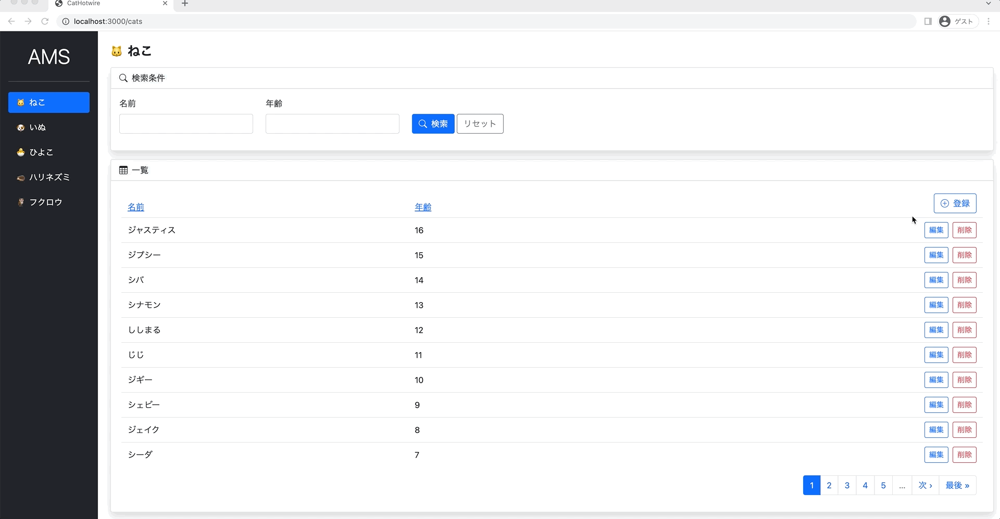
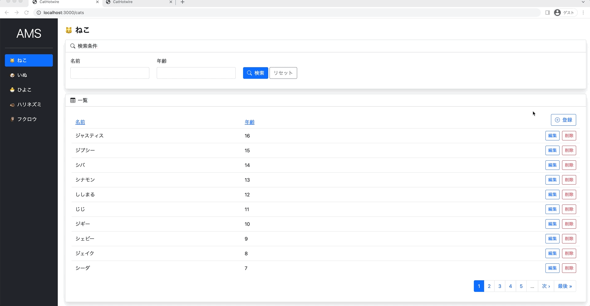
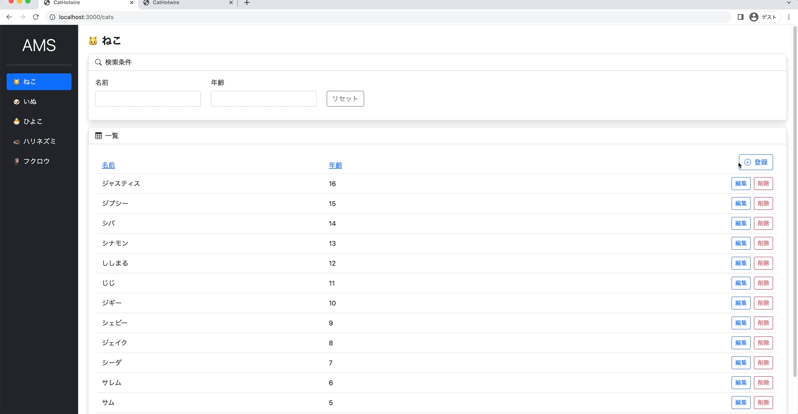

# 猫でもわかるHotwire入門 Turbo編
これは [猫でもわかるHotwire入門 Turbo編](https://zenn.dev/shita1112/books/cat-hotwire-turbo) のチュートリアルのリポジトリです。

詳しくは↑の本をごらんください〜。無料です〜。

## チュートリアル1 Railsで管理画面を作る

[チュートリアル1のデモはこちらから触れます](http://cat-hotwire-1.herokuapp.com/)

やったこと

- CRUD（一覧・編集・登録・削除）
- ページネーション
- 検索
- ソート
- 編集・登録時のインラインバリデーション

## チュートリアル2 Turboで管理画面をSPA風にする

[チュートリアル2のデモはこちらから触れます](http://cat-hotwire-2.herokuapp.com/)（動作が遅いのはHerokuのUSリージョンを使っているためです。Hotwireはレイテンシの影響をもろに受けます。）

やったこと

- ページネーションのTurbo化
- ソートのTurbo化
- 検索のTurbo化
- 編集のTurbo化
- 登録のTurbo化
- 削除のTurbo化

## チュートリアル3 Stimulusで管理画面をもっとSPA風にする

[チュートリアル3のデモはこちらから触れます](http://cat-hotwire-3.herokuapp.com/)（動作が遅いのはHerokuのUSリージョンを使っているためです。Hotwireはレイテンシの影響をもろに受けます。）

やったこと

- 検索のインスタントサーチ化
- 編集・登録のモーダル化
- ページネーション・ソート・検索時にURLが更新されるように修正
- ページネーションの無限スクロール化
- FlashのToast化
